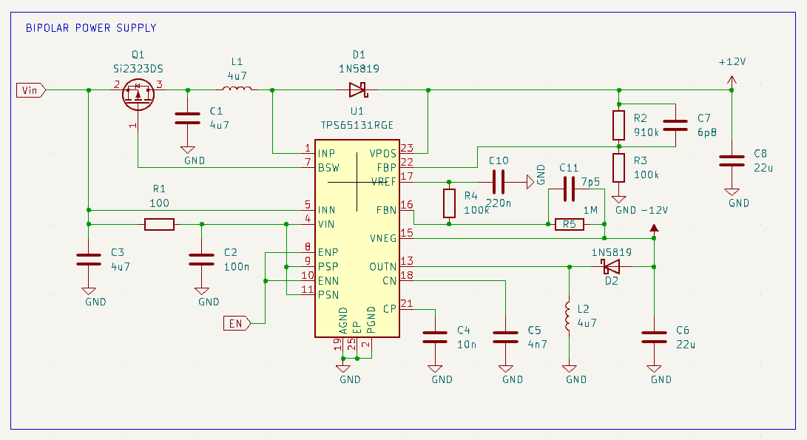
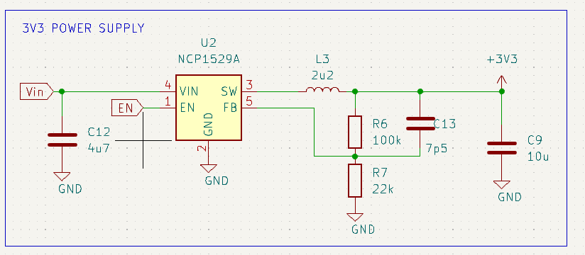
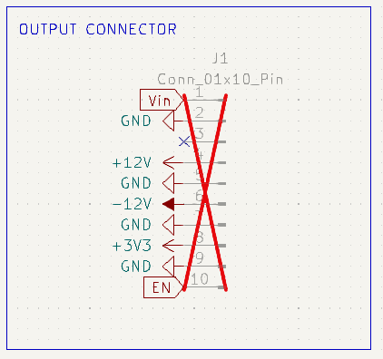
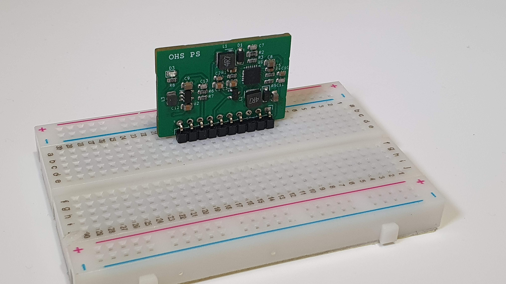
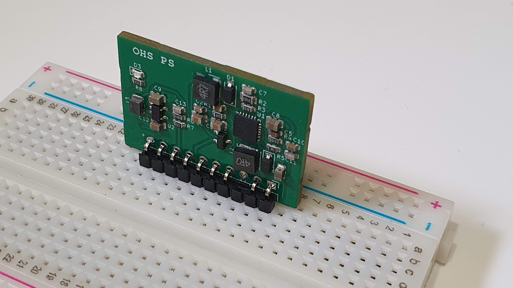
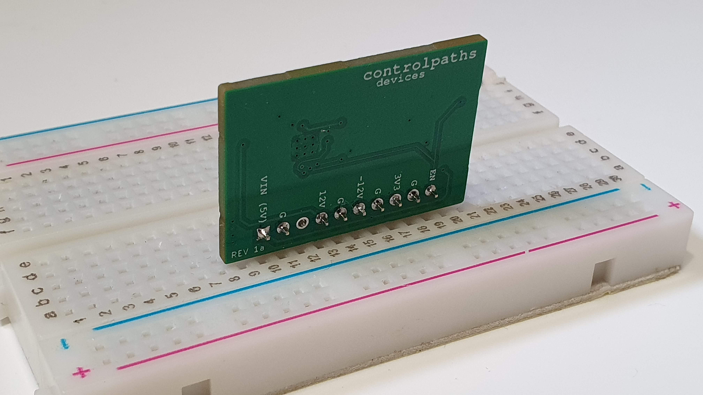
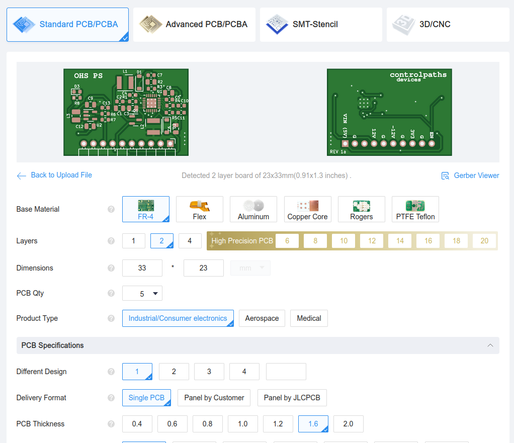

# Breadboard Power supply

This tiny board generates all the voltages needed for your signal processing designs. 

This board features a bipolar power supply and a single voltage power supply for control.

The bipolar power supply is managed by a [TPS65131](https://www.ti.com/product/es-mx/TPS65131). A split-rail converter with a maximum output current of 750 mA. The outputs of this power supply is configured for -12 V and +13 volts. 

The board also has a 3v3 volts, 1 Amp output generated by an NCP1529.

All the power rails as well as the the enable input and the input voltage are connected through a 2.54mm right angle connector ready to be inserted into a breadboard. 

## Galery

## Get yours

This board is open-source, so if you want to get yours, you can use the [output_files](./kicad/output_files/) to manufacture your own in [JLCPCB](https://jlcpcb.com/?from=controlpath). You just need to compress the file of the [output_files](./kicad/output_files/) and upload it to [JLCPCB](https://jlcpcb.com/?from=controlpath)

Remember to change the Surface Finish to LeadFree HASL to make your board ROHS compliant.

Also, they can assemble your board using the [centroid](./kicad/output_files/ohe_power_supply_1-all-pos.csv) file and the [BOM](./kicad/output_files/bom.csv) file, which are also available in this repository. Doing this, in a few days you will receive in your home some of these boards.
